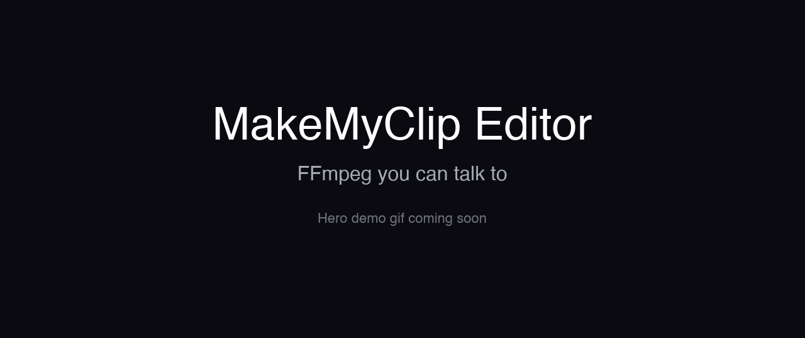

<p align="center">
  
</p>

<h1 align="center">MakeMyClip Editor</h1>

<p align="center"><b>FFmpeg you can talk to.</b><br/>
The open-source, local-first AI video editor — chat, CLI, or browser timeline.</p>

<p align="center">
  <a href="./LICENSE"></a>
  <a href="./package.json"></a>
  <a href="https://www.npmjs.com/package/@makemyclip/editor"></a>
  
  
</p>

<p align="center">
  
</p>

> Drag five screen recordings into a browser tab, type *"trim each to the most interesting 10 seconds, add title cards between them, render to 1080p"* — and Claude calls 19 deterministic FFmpeg tools to do it. No cloud, no account, no telemetry, no generative AI rewriting your audio. Just FFmpeg, named tools, and an op log you can `git diff`.

---

## Install in 30 seconds

**As a [Claude Code](https://claude.com/claude-code) skill** (chat-driven, no global install):

```bash
npx skills add MakeMyClip/editor
```

**As a CLI** (for scripts and CI):

```bash
npm i -g @makemyclip/editor
clip --help
```

**As a browser UI** (dark visual timeline editor):

```bash
clip ui   # opens http://127.0.0.1:5573
```

**As an MCP server** (drive it from Claude Desktop / Cursor / any MCP client — no API key, on your existing Claude):

```jsonc
// claude_desktop_config.json → "mcpServers"
{
  "makemyclip-editor": {
    "command": "npx",
    "args": ["-y", "@makemyclip/editor", "mcp"],
    "env": { "MAKEMYCLIP_WORKSPACE": "/path/to/your/media" }
  }
}
```

The Claude Code skill auto-discovers triggers and shells out via `npx -y` on demand. The MCP server exposes the timeline tools (show / edit / undo / redo / export) over stdio; media stays confined to `MAKEMYCLIP_WORKSPACE`. Everything runs locally and offline — no API key.

---

## One real example

Five screen recordings → one polished product demo. Type this into Claude Code (or Claude Desktop, via the MCP server):

> *Import these five recordings. Trim each to the most interesting 8–12 seconds. Add black title cards saying "Demo 1: Inbox", "Demo 2: Search", "Demo 3: Compose", "Demo 4: Calendar", "Demo 5: Reports" between them. Concat in order. Render to 1080p mp4.*

The agent runs roughly `ingest × 5` → `trim × 5` → `add_title_card × 5` → `concat` → `render`. The final mp4 lands in your workspace folder, every step is appended to `session.json`, and you can `⌘Z` any of it.

Or skip the chat and do it from a script:

```bash
clip ingest demo1.mp4
clip trim demo1.mp4 5 20
clip add_title_card demo1-trim.mp4 "Demo 1: Inbox"
clip concat demo1-with-card.mp4 demo2.mp4 demo3.mp4
clip render concat-output.mp4 mp4 23 fast 1920
```

Same registry, same session log, same output.

---

## What's in this release

19 tools across 5 categories, four surfaces (Claude Code skill, CLI, browser UI, MCP server), one shared op log.

| Category | Tools |
|---|---|
| **Cut & arrange** | `trim`, `split`, `concat`, `transition` (12 kinds) |
| **Text & captions** | `add_text`, `add_title_card`, `add_captions` |
| **Visual primitives** | `transform`, `adjust`, `zoom_pan` (Ken Burns), `overlay`, `speed` |
| **Composites & specialty** | `highlight_reel`, `silence_remove`, `chroma_key`, `stabilize` |
| **Output & I/O** | `ingest`, `preview`, `render`, `add_audio` |

Plus four meta-ops not in the registry: `snapshot`, `undo`, `inspect`, `delete`.

The browser UI is a dark timeline editor: drag-drop import, a monitor (the composited frame at the playhead), an editable timeline (select a clip to trim / split / move / transition / remove), one-click export, timeline undo/redo, snapshot, and keyboard shortcuts.

---

## Why it exists

Existing tools force a tradeoff that doesn't need to exist:

- **iMovie / CapCut / DaVinci Resolve** — mouse-and-timeline desktops. Can't be driven by an agent, scripted in CI, or version-controlled.
- **Descript** — closed-source, cloud-based, rewrites audio with generative AI you can't inspect.
- **Runway / Pika / Luma** — generate video from text. Useful for VFX, useless for assembling a 90-second demo from recordings you already have.
- **Raw FFmpeg** — deterministic and free, but the surface is hostile to LLMs: cryptic filter graphs, no session model, no undo, no tool catalog.

MakeMyClip Editor closes the gap: **deterministic FFmpeg editing with a 19-tool catalog any agent can call, a session log it can inspect, and a browser UI a human can drive when the agent goes off-script.**

<details>
<summary><b>Full comparison matrix</b> — features and use-cases vs. iMovie, Descript, Runway, raw FFmpeg</summary>

### Feature matrix

| Feature | MakeMyClip Editor | iMovie / CapCut | Descript | Runway / Pika | Raw FFmpeg |
|---|:---:|:---:|:---:|:---:|:---:|
| Agent-driven (chat to edit) | ✅ | ❌ | ⚠️ | ❌ | ❌ |
| Open-source (MIT) | ✅ | ❌ | ❌ | ❌ | LGPL/GPL |
| Local-only (no cloud) | ✅ | ✅ | ❌ | ❌ | ✅ |
| Deterministic output (no AI generation) | ✅ | ✅ | ✅ | ❌ | ✅ |
| Free forever | ✅ | ✅ | freemium | paid | ✅ |
| Programmable CLI | ✅ | ❌ | ❌ | API | ✅ |
| Visual timeline UI | ✅ | ✅ | ✅ | ✅ | ❌ |
| Snapshot & undo | ✅ | ✅ | ✅ | ⚠️ | ❌ |
| Inspectable session log (JSON) | ✅ | ❌ | ❌ | ❌ | ❌ |
| Works as a Claude Code skill | ✅ | ❌ | ❌ | ❌ | manual |
| Stream-copy for lossless cuts | ✅ | ⚠️ | ⚠️ | ❌ | ✅ |
| Zero telemetry | ✅ | ❌ | ❌ | ❌ | ✅ |

### Use-case matrix

| Job to be done | MakeMyClip Editor | iMovie / CapCut | Descript | Runway / Pika | Raw FFmpeg |
|---|:---:|:---:|:---:|:---:|:---:|
| Trim screen recordings to highlights | ✅ | ✅ | ✅ | ❌ | ✅ |
| Assemble a product demo from N clips + title cards | ✅ | ✅ | ⚠️ | ❌ | ⚠️ |
| Add script-provided timed captions | ✅ | ⚠️ | ✅ | ❌ | ⚠️ |
| Auto-transcribe & edit text-as-video | ⚠️ (bring transcript) | ⚠️ | ✅ | ❌ | ❌ |
| Auto-cut silence from a recording | ✅ | ❌ | ✅ | ❌ | ⚠️ |
| Chroma-key / green-screen compositing | ✅ | ⚠️ | ⚠️ | ⚠️ | ✅ |
| Generate b-roll / VFX shots from a prompt | ❌ | ❌ | ⚠️ | ✅ | ❌ |
| Multi-track audio mixing with effects | ❌ | ⚠️ | ✅ | ❌ | ⚠️ |
| Drive editing from an AI agent in natural language | ✅ | ❌ | ⚠️ | ⚠️ | ❌ |
| Run as a scriptable CI pipeline | ✅ | ❌ | ❌ | ⚠️ (API) | ✅ |
| Long-form (>30 min) with hundreds of clips | ⚠️ | ✅ | ✅ | ❌ | ✅ |
| Edit on Linux / headless / fully offline | ✅ | ❌ | ❌ | ❌ | ✅ |

Legend: ✅ great fit · ⚠️ works but not the best · ❌ doesn't fit.

**Honest summary:** MakeMyClip Editor is the right pick when you want deterministic, scriptable editing that an AI agent can drive end-to-end. Not the right pick for generative video (Runway), text-as-video transcript editing (Descript), or a heavy multi-track NLE (DaVinci, Premiere).

</details>

<details>
<summary><b>Architecture</b> — four surfaces, one composition document, one append-only op log</summary>

```
Claude Code  →  skill triggers  →  npx -y @makemyclip/editor <tool | timeline …>
                                           │
Browser UI   →  /api/tools/:name · /api/timeline/verbs  →  registry + verb layer
                                           │
Claude Desktop →  clip mcp (MCP server)  →  timeline verbs
                                           │
                                           ▼
                                  Tool handlers (TypeScript)
                                           │
                                           ▼
                                 FFmpeg subprocess (args as array, no shell)
                                           │
                   ┌───────────────────────┴───────────────────────┐
                   ▼                                                 ▼
        Composition document                              session.json
        (non-destructive timeline,                        (append-only op log
         op-log undo/redo)                                 of every tool call)
```

Two layers of state, by design. The **composition document** is the source of truth for assembled edits: a non-destructive, multi-track timeline that `clip timeline`, the browser UI, and the agent (the Claude Code skill or the `clip mcp` server) all mutate through one op-aware path, with a coupled op log that powers undo/redo. **`session.json`** is an append-only op log of every tool invocation — `{ id, tool, args, result, timestamp }` — written through the same `appendOp()` path by the single-file tools (`clip trim`, `/api/tools/:name`, …); it is the audit trail and recovery layer. Both layers are written through one serialized path, so any combination of human + agent edits stays consistent.

**Build a composition end-to-end** (CLI shown; the browser UI and the agent — Claude Code or MCP — drive the same document):

```bash
clip timeline new                       # start an empty composition
clip timeline add-media intro.mp4       # ingest + append a clip
clip timeline add-media demo.mp4
clip timeline transition <afterClipId> fade 0.5
clip timeline show                      # inspect tracks, clips, timings
clip timeline export final.mp4          # compile the document to a render
```

Every edit is undoable (`clip timeline undo` / `redo`, `clip timeline log`), and `clip timeline at <sec>` / `frame <sec>` give an agent read-only eyes on the document. Run `clip timeline --help` for the full subcommand list.

- **Language:** TypeScript (Node 24+) and React 19 (browser UI)
- **Timeline schema:** [Zod](https://zod.dev/) (shared with the [MakeMyClip.com](https://makemyclip.com) web app)
- **Subprocess:** [execa](https://github.com/sindresorhus/execa) — args as an array, no shell injection
- **FFmpeg:** bundled via `ffmpeg-static`, with `MAKEMYCLIP_FFMPEG_PATH` override or system-binary fallback
- **MCP:** [`@modelcontextprotocol/sdk`](https://modelcontextprotocol.io/) — the `clip mcp` server (Claude Desktop / any MCP client)
- **UI:** Hono server + Vite + React, plain CSS

</details>

<details>
<summary><b>FAQ</b> — setup, capabilities, privacy, AI integration, comparisons, license</summary>

### Setup & installation

**Do I need FFmpeg installed separately?**
No. MakeMyClip Editor bundles FFmpeg via `ffmpeg-static`, so installing the npm package or running `npx skills add MakeMyClip/editor` is all you need. For your own FFmpeg build (LGPL-only, custom codecs, hardware acceleration), set `MAKEMYCLIP_FFMPEG_PATH` to its path and the bundled binary is ignored.

**What platforms does it run on?**
macOS, Linux, and Windows — anywhere Node 24+ runs. The browser UI binds to `127.0.0.1` and needs no internet connection.

**Can I use it without Claude Code?**
Yes. The `clip` CLI and `clip ui` browser app are first-class surfaces, and `clip mcp` lets Claude Desktop (or any MCP client) drive it. Claude Code is one of several entry points — the editor is agnostic to which agent (or human) drives it.

**Does it require an API key?**
No — nowhere. The CLI, the browser UI, the Claude Code skill, and the MCP server all run with no API key. Agent-driven editing uses whichever Claude you already run (Claude Code, or Claude Desktop via MCP); the editor itself never calls a model.

### Capabilities & limits

**Is it production-ready?**
This release is feature-complete for local editing — a dark timeline editor (view, edit, preview, export), 19 single-file tools, an MCP server, and 542 tests passing. The API surface is still pre-1.0 (tool schemas may change in minor ways before 1.0). Use it for real work; pin a version in CI.

**What's the maximum video size or duration?**
No hardcoded limit. FFmpeg streams the file rather than loading it into memory, and the browser UI streams uploads to disk — multi-GB recordings work fine. This release isn't tuned for projects with hundreds of clips or runtime above 30 minutes; for those, drive the CLI directly.

**Does it support 4K, HDR, or vertical (TikTok / Reels) formats?**
4K and vertical aspect ratios work out of the box — `render` takes a `maxWidth` and preserves the source aspect ratio. HDR pass-through works; deliberate HDR-to-SDR tone-mapping isn't a named tool yet.

**Does it support MCP (Model Context Protocol)?**
Yes. `clip mcp` runs an MCP server over stdio exposing the timeline tools (show / edit / undo / redo / export). Add it to Claude Desktop or any MCP client to drive the editor on your own Claude — no API key. (See "Install in 30 seconds" for the config.)

### Privacy & data

**Does it send my video files anywhere?**
No. The editor makes zero network calls — period. The agent runs in Claude Code or Claude Desktop, not inside the editor, so nothing leaves your machine.

**Where does it store my files?**
In a local workspace folder — `$TMPDIR/makemyclip-editor` by default; override with `MAKEMYCLIP_WORKSPACE`. The folder holds input files, output files, `composition.json` (the timeline), `session.json` (the op log), and `snapshots/`. You can version-control the whole folder.

### Working with agents

**Which AI model does it use?**
None — the editor embeds no model. The agent is whatever you already run: Claude Code, or Claude Desktop / Cursor via the MCP server. They call the editor's tools; the editor executes them deterministically with FFmpeg.

**How does the agent know which tool to call?**
Each tool and timeline verb ships with a Zod input schema (parameter docs inline via `.describe()`) and a one-line description. The Claude Code skill and the MCP server expose that catalog to the agent; it reads the descriptions, picks a tool, and fills in the arguments.

**What if the agent makes a mistake?**
Every edit appends to `session.json` and produces a new output file in the workspace; nothing is destructive. Press `⌘Z` to pop the last op; click Snapshot before risky operations to save a named restore point; the entire workspace is a folder you can `git init`.

### License & comparisons

**Is it free?**
Yes — MIT-licensed, free forever for local editing. No paid tier, no signup, no upsell in the editor. Paid AI-generation features (voice synthesis, music, stock footage) will live on [MakeMyClip.com](https://makemyclip.com) when they ship, behind a separate `@makemyclip/generation` package.

**What's the license situation with the bundled FFmpeg?**
The MakeMyClip Editor source code is [MIT](./LICENSE). The bundled FFmpeg binary (via `ffmpeg-static`) is GPL-licensed because it includes codecs like libx264 and libx265. Subprocess invocation keeps GPL terms confined to the binary, not your application code. For LGPL-only or custom-build requirements (e.g. iOS App Store), set `MAKEMYCLIP_FFMPEG_PATH` to your own binary.

**How does it compare to Descript?**
Descript edits text-as-video using generative AI to rewrite audio. MakeMyClip Editor edits video as video, using deterministic FFmpeg operations — every cut is exact, lossless where possible, reproducible. Descript is closed-source and cloud-only; MakeMyClip Editor is MIT and local.

**How is this different from running FFmpeg directly?**
FFmpeg is one binary with a complex CLI; MakeMyClip Editor is 19 named tools with typed inputs, a session log, snapshot/undo, a browser UI, and an agent-callable API. You're still running FFmpeg under the hood — but with a catalog any LLM can call, input validation that prevents bad commands, and a log you can inspect or version-control.

**What's the relationship between this editor and the MakeMyClip.com website?**
The editor (this repo) is MIT-licensed, free, local, and limited to deterministic FFmpeg operations. [MakeMyClip.com](https://makemyclip.com) is the separate hosted product where paid AI generation features will live. The two share the timeline schema, so projects move between them.

**How do I add my own editing tool?**
Add a file in `src/tools/<name>.ts` exporting a Zod input schema and a handler, register it in [`src/ui/tool-registry.ts`](src/ui/tool-registry.ts), and the tool becomes available in the CLI and the browser UI's tool picker. See [AGENTS.md](./AGENTS.md) for conventions.

</details>

---

## When to use it

✅ **Great fit** for: assembling product demos, screen recordings, tutorials, and social clips with an AI agent doing the labor · scripting repeatable video pipelines in CI · sharing version-controllable timeline JSON · editing offline.

❌ **Not the right tool** for: frame-accurate color grading (use DaVinci Resolve) · multi-track audio mixing with effects (use Reaper, Logic) · generative-AI video (use Runway, Pika) · long-form projects with hundreds of clips.

## Roadmap

- **Now** — feature-complete local editing: a dark timeline editor (view / edit / preview / export), 19 tools, MCP server, snapshot/undo
- **Next** — model picker, SSE for live session updates, AI Elements / shadcn migration
- **1.0** — frozen tool schemas, MCP transport, published Anthropic skill, docs site
- **Beyond** — desktop app (Electron), cloud rendering via [MakeMyClip.com](https://makemyclip.com)

The full milestone log lives in PR descriptions on [GitHub](https://github.com/MakeMyClip/editor/pulls?q=is%3Apr+label%3Aui).

## Acknowledgments

Built on the work of [FFmpeg](https://ffmpeg.org/), the [Model Context Protocol](https://modelcontextprotocol.io/), [Anthropic Claude](https://www.anthropic.com/), [Zod](https://zod.dev/), [Hono](https://hono.dev/), [Vite](https://vite.dev/), and [React](https://react.dev/).

## Links

| | |
|---|---|
| **npm** | [`@makemyclip/editor`](https://www.npmjs.com/package/@makemyclip/editor) |
| **Skill page** | [skills.sh/MakeMyClip/editor](https://skills.sh/MakeMyClip/editor) |
| **GitHub** | [MakeMyClip/editor](https://github.com/MakeMyClip/editor) |
| **Website** | [makemyclip.com](https://makemyclip.com) |
| **For AI agents** | [llms.txt](./llms.txt) |
| **Issues** | [GitHub Issues](https://github.com/MakeMyClip/editor/issues) |

## License

[MIT](./LICENSE) for the editor source; GPL for the bundled FFmpeg binary (subprocess-isolated). Use it, fork it, ship it.
